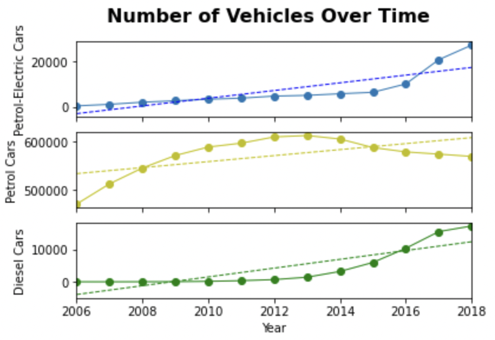

## 5.3: Introduction to Statistics

### Overview

In today’s class, the students will review the summary statistics that were previously taught in Unit 1, and the implementation of these statistical measures in Python. This lesson also introduces new statistical concepts, such as sample versus population, standard error, Pearson correlation coefficient, and linear regression.

#### Class Objectives

By the end of this lesson, the students will be able to:

Calculate summary statistics, such as mean, median, mode, variance, and standard deviation, by using Python.

Plot, characterize, and quantify a normally distributed dataset by using Python.

Qualitatively and quantitatively identify potential outliers in a dataset.

Differentiate between a sample and a population in regard to a dataset.

Define and quantify correlation between two factors.

Calculate and plot a linear regression in Python.

---

### Instructor Notes

When teaching, prioritize the following points:

* The students should be able to plot and characterize a dataset using Matplotlib.

* The students should be able to determine which Python module is most appropriate to calculate their summary statistics depending on their datasets.

* The students should be able to identify when they have a sample dataset versus a population dataset.

* The students should be able to differentiate between a correlation and a regression analysis.

The goal of today's material is to empower the students to use statistical tools for describing and discussing data. Take your time, and ensure that the students understand the concepts behind each statistical topic before discussing the functions in Python.

To minimize any feelings of thematic discontinuity with the previous days’ Matplotlib work, emphasize taking a graphical approach to understanding today's concepts.

---

### Class Slides

The slides for this lesson can be viewed on Google Drive here: [Lesson 5.3 Slides](https://docs.google.com/presentation/d/13bbYKmjgFTZivP2CfdOcc1mFaRdglEbSPulGjSwZtlI/edit?usp=sharing).

To add the slides to the student-facing repository, download the slides as a PDF by navigating to File, selecting "Download as," and then choosing "PDF document." Then, add the PDF file to your class repository along with other necessary files. You can view instructions for this [here](https://docs.google.com/document/d/1XM90c4s9XjwZHjdUlwEMcv2iXcO_yRGx5p2iLZ3BGNI/edit).

**Note:** Editing access is not available for this document. If you wish to modify the slides, create a copy by navigating to File and selecting "Make a copy...".

---

### Time Tracker

| Start Time | Number | Activity                                           | Duration |
| ---------- | ------ | -------------------------------------------------- | -------- |
| 6:30 PM    | 1      | Instructor Do: Welcome Students                    | 0:05     |
| 6:35 PM    | 2      | Instructor Do: Summary Statistics in Python        | 0:15     |
| 6:50 PM    | 3      | Instructor Do: Quantiles and Outliers in Python    | 0:10     |
| 7:00 PM    | 4      | Students Do: Summary Statistics in Python          | 0:15     |
| 7:15 PM    | 5      | Review Summary Statistics in Python                | 0:10     |
| 7:25 PM    | 6      | Instructor Do: Sample, Population, and SEM         | 0:15     |
| 7:40 PM    | 7      | Students Do: SEM and Error Bars                    | 0:15     |
| 7:55 PM    | 8      | Review: SEM and Error Bars                         | 0:10     |
| 8:05 PM    | 9      | BREAK                                              | 0:15     |
| 8:20 PM    | 10     | Instructor Do: Correlation Conundrum               | 0:15     |
| 8:35 PM    | 11     | Students Do: Correlation Conquerors                | 0:10     |
| 8:45 PM    | 12     | Review: Correlation Conquerors                     | 0:05     |
| 8:50 PM    | 13     | Instructor Do: Fits and Regression                 | 0:15     |
| 9:05 PM    | 14     | Students Do: Fits and Regression                   | 0:15     |
| 9:20 PM    | 15     | Review: Fits and Regression                        | 0:05     |
| 9:25 PM    | 16     | Instructor Do: Close Class                         | 0:05     |
| 9:30 PM    |        | END                                                |          |

---

### 1. Instructor Do: Welcome Students (5 min)

Open the slideshow, and welcome the class while covering the following talking points:

* Welcome to Day 3 of Matplotlib. Today's lesson combines our knowledge of fundamental statistics with Matplotlib and SciPy.

* Once we’re comfortable with basic statistics in Python, we will introduce a few new statistical concepts and models that students can use in their projects.

---

### 2. Instructor Do: Summary Statistics in Python (15 min)

**Corresponding Activity:** [01-Ins_Summary_Statistics](Activities/01-Ins_Summary_Statistics/)

Return to the slideshow to accompany the demo. Discuss the following talking points:

Begin by asking the class to define the measure of central tendency.

Remind the students that the measure of central tendency is the center of a dataset and is commonly referred to as an average.

* The most common measures of central tendency are the **mean**, **median**, and **mode**.

* The **mean** of a dataset is the arithmetic average of a dataset. It is calculated from the sum of all of the numbers divided by the number of elements in the dataset.

* The **median** of a dataset is the middle element. It is calculated by listing the data numerically and selecting the middle element. For even-length datasets, the average of the two middle elements is the median of the dataset.

* The **mode** of a dataset is the most frequently occurring element. The mode can be used for either numeric or categorical data, as captured in the following image:

    

Explain that Python offers multiple ways to measure the central tendency of the data; however, for this class, we will be looking at the NumPy and SciPy packages and modules.

* We will use the NumPy package to test for `mean` and `median`, and we’ll use the SciPy package to test for `mode`.

* We need to use both NumPy and SciPy modules to calculate the measures of central tendency because the mode is not a function in NumPy. This is likely because NumPy is a lightweight module and calculating the mode can be computationally intensive.

Point out that Pandas also provides functions to measure central tendency, but students will need to check out that documentation on their own.

Explain that our main focus today is learning how to characterize, analyze, and visualize new data.

* We generally want to plot new data as soon as possible to identify key characteristics of the dataset.

* Key characteristics can include if the data is normally distributed, if the data is multimodal, or if there are clusters in the data.

* Another characteristic of normally distributed data is that its distribution follows a characteristic bell-curve shape.

Ask the students to define **variance** and **standard deviation**.

* **Variance** is the measurement of how far each number in the dataset is from the mean of the dataset.

* **Standard deviation** is the square root of the variance.

* When calculating the variance and standard deviation in Python, we will use the NumPy module.

Open the solved file.

Execute the first three blocks of code:

```python
# Import dependencies
import pandas as pd
import matplotlib.pyplot as plt
import scipy.stats as st
import numpy as np

# Read in the LAX temperature data
temperature_df = pd.read_csv('../Resources/lax_temperature.csv')
temperatures = temperature_df['HourlyDryBulbTemperature']

# Demonstrate calculating measures of central tendency
mean_numpy = np.mean(temperatures)
print(f"The mean temperature at the LAX airport is {mean_numpy}")

median_numpy = np.median(temperatures)
print(f"The median temperature at the LAX airport is {median_numpy}")

mode_scipy = st.mode(temperatures)
print(f"The mode temperature at the LAX airport is {mode_scipy}")
```

Explain to the students that this first dataset contains National Oceanic and Atmospheric Administration temperature measurements taken at the Los Angeles International (LAX) airport.

* When calculating the mean, NumPy provides a decimal with far too much precision. Therefore, we should always round the output of `numpy.mean`. In most cases, rounding the mean to the nearest hundredth decimal is sufficient.

* When calculating the median, NumPy also can provide a decimal with far too much precision. However, with this dataset, the median was already rounded.

* When calculating the mode, the `scipy.stats` module returns 2 arrays, one for all mode values and another for the frequency of each mode.

Remind the students that the easiest way to determine if a dataset has multiple modes, clusters of values, or a normal distribution, is to plot the data using Matplotlib.

Execute the next block of code:

```python
# Characterize the dataset using Matplotlib and stats.normaltest
plt.hist(temperatures)
plt.xlabel('Temperature (°F)')
plt.ylabel('Counts')
plt.show()
print(st.normaltest(temperatures.sample(50)))
```

The following image captures the resulting histogram:


Point out to the students that there only appears to be one mode in the dataset. Furthermore, the distribution of temperatures around the mode seems to form a bell curve.

* This bell-curve characteristic is known in statistics as a **normal distribution**.

* The theory behind a **normal distribution** is outside of the scope of this lesson, but it is important to know whether your data is normally distributed.

Explain that many statistical tests assume that the data is normally distributed. Using such statistical tests when the data is _not_ normally distributed can cause us to draw incorrect conclusions.

* The `stats.normaltest` function offers a more quantitative verification of normal distribution.

* When we used `stats.normaltest` in our example code, we also used the Pandas `DataFrame.sample` function.

* Because the `stats.normaltest` function is using a small sample size of randomly selected values using Pandas's `DataFrame.sample` function.  We interpret the results of `stats.normaltest` using the **p**-value. A **p**-value 0.05 or larger indicates normally distributed data.

* Because our p-value is approximately 0.05 or greater, we can conclude that this distribution is normal.

* However, if we run the normality test on the whole dataset as the following code shows:

    ```python
    # Run the normality test on the whole temperatures DataFrame.
    print(st.normaltest(temperatures.sample(3529)))
    ```

* The results of the `stats.normaltest` test show that it fails the normality test fails because the **p**-value is very small. We can conclude that the data is _not_ normally distributed.

Execute the next code block:

```python
# Demonstrate calculating the variance and standard deviation using the different modules
var_numpy = np.var(temperatures,ddof = 0)
print(f"The population variance using the NumPy module is {var_numpy}")

sd_numpy = np.std(temperatures,ddof = 0)
print(f"The population standard deviation using the NumPy module is {sd_numpy}")
```

Point out that to calculate the total variance or standard deviation in NumPy, we must provide the list of numbers as well as `ddof =0`.

* The `ddof = 0` argument is to ensure we calculate the population variance and standard deviation.

* We will talk about sample versus population later in the class.

Execute the next code block:

```python
# Calculate the 68-95-99.7 rule using the standard deviation
print(f"Roughly 68% of the data is between {round(mean_numpy-sd_numpy,3)} and {round(mean_numpy+sd_numpy,3)}")
print(f"Roughly 95% of the data is between {round(mean_numpy-2*sd_numpy,3)} and {round(mean_numpy+2*sd_numpy,3)}")
print(f"Roughly 99.7% of the data is between {round(mean_numpy-3*sd_numpy,3)} and {round(mean_numpy+3*sd_numpy,3)}")
```

Remind the students that when we have a dataset that is normally distributed, we can use the **68-95-99.7** rule to characterize the data.

* The **68-95-99.7** rule states that roughly 68% of all values in normally distributed data fall within one standard deviation of the mean (in either direction). Additionally, 95% of the values fall within two standard deviations, and 99.7% of the values fall within three standard deviations.

Ask the students to define the **z-score**.

* The **z-score** is the number of standard deviations a given number is from the mean of the dataset.

* To calculate a z-score in Python, we must use the SciPy `stats.zscore` function.

Execute the next code block:

```python
# Demonstrate calculating the z-scores using SciPy
z_scipy = st.zscore(temperatures)
print(f"The z-scores using the SciPy module are {z_scipy}")
```

Point out that the output of `stats.zscore` is a list of z-scores that is equal in length to the list of temperatures. Therefore, if we want to know the z-score for any given value, we must find and use the index of that value from the temperature list.

Send out the solution notebook for the students to refer to later.

Data Source: NOAA National Centers for Environmental Information, Climate Data Online. [https://www.ncei.noaa.gov/products/land-based-station/us-climate-normals](https://www.ncei.noaa.gov/products/land-based-station/us-climate-normals)

---

### 3. Instructor Do: Quantiles and Outliers in Python (10 min)

**Corresponding Activity:** [02-Ins_Quartiles_and_Outliers](Activities/02-Ins_Quartiles_and_Outliers/)

Return to the slideshow to accompany the beginning of this section.

Begin this section by asking the class to define **quantiles**, **quartiles**, and **outliers**.

* **Quantiles** divide our data into well-defined regions based on their order in a ranked list. The 2 most commonly used quantiles are **quartiles** and **percentiles**.

* **Quartiles** divide the sorted data into four equal-sized groups, and the median is known as the second quartile.

* An **outlier** is an extreme value that can skew a dataset. An **outlier** is typically identified as a value that is 1.5 * IQR (**interquartile range**) beyond the first and third quartiles.

* We can visually identify quartiles and outliers using a box and whisker plot. Alternatively, we can identify quartiles using the **1.5 * IQR** rule.

* When datasets are too large to identify the outliers visually, or when analysis requires more quantitative measures, we should calculate the interquartile range manually using Python modules.

Now, open the solved file and run the first two blocks of code:

```python
# Import dependencies
import pandas as pd
import numpy as np
import matplotlib.pyplot as plt

# Example outlier plot of reaction times
times = [96,98,100,105,85,88,95,100,101,102,97,98,5]
fig1, ax1 = plt.subplots()
ax1.set_title('Reaction Times at Baseball Batting Cage')
ax1.set_ylabel('Reaction Time (ms)')
ax1.boxplot(times)
plt.show()
```

The following image captures the resulting plot:


Explain that this first dataset is a theoretical collection of reaction times measured at a baseball batting cage.

Explain that a box and whisker plot is widely used in data science due to the amount of information it provides at a glance.

* We render a box and whisker plot in Matplotlib by using the `pyplot.boxplot` function.

* The `pyplot.boxplot` function simply requires a list of numbers.

* The orange line in the box plot is the median of the data.

* The box surrounding the median is the IQR.

* The whiskers that protrude from the box in the plot can be modified depending on the use, but by default the whiskers represent 1.5 * IQR, or the outlier boundaries.

* The data points that are located beyond the whiskers in the plot are potential outliers.

* In this dataset, the two smallest data points appear to be outliers.

Display and explain the following annotated box plot for visual guidance:


Execute the next block of code:

```python
# Sort the data to determine which could be outliers
times.sort()
print(times)
```

Explain that once we’ve identified potential outliers in a box and whisker plot, we can use the sorted dataset to estimate which data points fall outside the outlier boundary.

Point out that the 5 ms and 85 ms reaction time data points are outside of the whiskers and may merit investigation.

Execute the next block of code:

```python
# The second example again looks at the LAX temperature data set and computes quantiles
temperature_df = pd.read_csv('../Resources/lax_temperature.csv')
temperatures = temperature_df['HourlyDryBulbTemperature']

fig1, ax1 = plt.subplots()
ax1.set_title('Temperatures at LAX')
ax1.set_ylabel('Temperature (°F)')
ax1.boxplot(temperatures)
plt.show()
```

The following image captures the resulting box and whisker plot:


Explain to the students that this example is looking back at the LAX temperatures from NOAA.

* This dataset has over 3,000 data points, and we already know it to be normally distributed.

* When we know a dataset is normally distributed, we can expect at least a few data points to be potential outliers.

Explain to the class that we can also identify potential outliers by using Pandas.

Explain that we can use Pandas to easily calculate the interquartile range to generate the outlier boundaries.

Execute the next block of code:

```python
# If the data is in a DataFrame, we use pandas to give quartile calculations
quartiles = temperatures.quantile([.25,.5,.75])
lowerq = quartiles[0.25]
upperq = quartiles[0.75]
iqr = upperq-lowerq

print(f"The lower quartile of temperatures is: {lowerq}")
print(f"The upper quartile of temperatures is: {upperq}")
print(f"The interquartile range of temperatures is: {iqr}")
print(f"The the median of temperatures is: {quartiles[0.5]} ")

lower_bound = lowerq - (1.5*iqr)
upper_bound = upperq + (1.5*iqr)
print(f"Values below {lower_bound} could be outliers.")
print(f"Values above {upper_bound} could be outliers.")
```

Explain that to properly calculate the lower and upper quartiles of a dataset, we would need to calculate the median of our dataset. Once we split our data into two groups using the median, we would then need to find the median of the lower and upper groups to determine the quartiles.

Explain that a very common practice in data science is to approximate the median-of-a-median quartile values by using prebuilt quantile functions such as Pandas's `quantile` method.

Point out that Pandas's `quantile` method requires decimal values between 0 and 1. In addition, we must pass the quantile as the index instead of relative index values.

```python
# You cannot pass a 0 index to retrieve the first element,
# it requires the actual value of 0.25
lowerq = quartiles[0.25]
```

Point out that once you have calculated the IQR, you can create the boundaries to quantitatively determine any potential outliers.

Send out the solution notebook for the students to refer to in the next activity.

Data Source: NOAA National Centers for Environmental information, Climate Data Online. [https://www.ncei.noaa.gov/products/land-based-station/us-climate-normals](https://www.ncei.noaa.gov/products/land-based-station/us-climate-normals)

---

### 4. Students Do: Summary Statistics in Python (15 min)

**Corresponding Activity:** [02-Ins_Quartiles_and_Outliers](Activities/03-Stu_Summary_Stats_Python/)

Send the unsolved file and the README to the students and go over the instructions.

In this activity, the students will calculate a number of summary statistics using California housing data.

You may choose to use the slideshow to accompany this activity.

---

### 5. Review Summary Statistics in Python (10 min)

**Corresponding Activity:** [02-Ins_Quartiles_and_Outliers](Activities/03-Stu_Summary_Stats_Python/)

Open the solved file.

Explain and go through the first two blocks of code:

```python
# Import dependencies
import pandas as pd
import matplotlib.pyplot as plt
import scipy.stats as st

# Read in the California housing dataset
california_data = pd.read_csv('../Resources/California_Housing.csv')
california_data.head()
```

Explain that the first few blocks of code simply read in the California housing data from the `Resources` folder using Pandas.

Execute the next block of code:

```python
# Determine which measure of central tendency is most appropriate to describe the population
plt.hist(california_data['Population'])
plt.xlabel('Population')
plt.ylabel('Counts')
plt.show()
print(california_data['Population'].mean())
print(california_data['Population'].median())
print(california_data['Population'].mode())
```

The following image captures the resulting plot:


Explain that in most cases, we would plot the data using a histogram to determine the most appropriate way to measure the central tendency.

Point out that this data appears to be right-skewed, so the median is arguably the most appropriate.

Explain that because the mean, median, and mode all are between 1,100 and 1,400, all three measures of central tendency describe the center of the dataset.

* Point out that all three measures are roughly the same due to the limited number of data points in the dataset.

* Caution the students that when datasets are larger, the mean becomes more affected by the skew and will no longer describe the center of the data.

Execute the next code block:

```python
# Determine if the house age in California is normally distributed
plt.hist(california_data['HouseAge'])
plt.xlabel('House Age (years)')
plt.ylabel('Counts')
plt.show()
print(st.normaltest(california_data["HouseAge"].sample(100)))
print(st.normaltest(california_data["HouseAge"].sample(2000)))
```

The following image captures the resulting histogram:


Point out that this data is a little fatter than a normal bell-curve shape, but it visually resembles a normal distribution.

Remind the students that when a dataset is large, we have to be careful how we identify normal distribution.

Explain that to calculate how normally distributed the data is, we must first take a random sample of rows using the Pandas `sample` function. Once we have our sample data, we can test for normality using `stats.normaltest`.

Point out that running the `normaltest` several times results in the p-value fluctuating around or above 0.05, which means the data is normally distributed. However, using a larger datasets indicates that the data isn't normall distributed.

Execute the next code block:

```python
# Determine if there are any potential outliers in the average occupancy in California
quartiles = california_data['AveOccup'].quantile([.25,.5,.75])
lowerq = quartiles[0.25]
upperq = quartiles[0.75]
iqr = upperq-lowerq

print(f"The lower quartile of occupancy is: {lowerq}")
print(f"The upper quartile of occupancy is: {upperq}")
print(f"The interquartile range of occupancy is: {iqr}")
print(f"The the median of occupancy is: {quartiles[0.5]} ")

lower_bound = lowerq - (1.5*iqr)
upper_bound = upperq + (1.5*iqr)
print(f"Values below {lower_bound} could be outliers.")
print(f"Values above {upper_bound} could be outliers.")

outlier_occupancy = california_data.loc[(california_data['AveOccup'] < lower_bound) | (california_data['AveOccup'] > upper_bound)]
outlier_occupancy
```

Explain that we can use the 1.5 * IQR rule to identify potential outliers in the dataset.

Explain that once we have the lower and upper outlier bounds, we can use Pandas to filter the data. Go through the code that filters the DataFrame by using `loc` and the output DataFrame.

Point out that there are 100 potential outliers in the "Average Occupancy".

Execute the next code block:

```python
# With the potential outliers, what is the lowest and highest median income (in $1000s) observed?
print(f"The minimum median income of the potential outliers is {outlier_occupancy['MedInc'].min()}")
print(f"The maximum median income of the potential outliers is {outlier_occupancy['MedInc'].max()}")
```

Explain that once we have the filtered DataFrame, we can use the `min` and `max` functions on the median income column to determine the min and max values.

Execute the final code block:

```python
# Plot the latitude and longitude of the California housing data using Matplotlib, and color the data points using the median income of the block
plt.scatter(california_data['Longitude'],california_data['Latitude'],c=california_data['MedInc'])
clb = plt.colorbar()
plt.xlabel("Longitude")
plt.ylabel("Latitude")
clb.set_label("Median Income")
plt.show()
```

The following image captures the resulting plot:


Point out if we plot the latitude and longitude on a scatter plot, we get a rough outline of the state of California.

Explain that by coloring the data points according to median income data, a trend emerges from where the outliers are relative to their position in the state.

Point out that Los Angeles may have some potential outliers in the data along with some in Northern California. Neat!

Send out the solution for the students to review later.

Data Source: U.S. Department of Commerce Bureau of the Census. 1990 Census of Housing General Housing Statistics: California. [https://www2.census.gov/library/publications/decennial/1990/ch-1/ch-1-6.pdf](https://www2.census.gov/library/publications/decennial/1990/ch-1/ch-1-6.pdf)

---

### 6. Instructor Do: Sample, Population, and SEM (15 min)

**Corresponding Activity:** [04-Ins_Standard_Error](Activities/04-Ins_Standard_Error/)

Return to the slideshow to accompany this activity.

Begin the activity by introducing the following scenario: Weeks before Election Day, a local newspaper in a hypothetical city wants to predict the winner of the mayoral election. The newspaper will poll voters for their preferred candidate. Point out the following:

* It would be prohibitively expensive to ask every voter in the city for their preferred candidate, and it is not possible to know who will go out and vote on Election Day.

* The newspaper must, therefore, ask a _subset_ of all eligible voters in the city about their voting habits and _extrapolate_ information from the results.

* In this scenario, the newspaper decides to poll 1,000 eligible voters shopping at grocery stores across the city.

* By using the polling results from the 1,000 eligible voters, the newspaper can try to make an accurate prediction of the mayoral election outcome.

Explain that this hypothetical scenario is an example of a **sample** dataset versus a **population** dataset.

* In statistics, a **population** is a complete dataset that contains all possible elements of a study or experiment.

* In this scenario, the population dataset would be the voting habits of all eligible voters in the city.

* In statistics, a **sample** is a subset of a population dataset where not all elements of a study or experiment are collected or measured.

* In this scenario, the sample dataset consists of the 1,000 eligible voters polled across the city.

* In data science, the concept of sample versus population does not strictly apply to people or animals. Any comprehensive dataset is considered a population, and any dataset that is a subset of a larger dataset is considered a sample.

Open the solved file and run the first two blocks of code to bring in the fuel economy dataset:

```python
# Import dependencies
import pandas as pd
import random
import matplotlib.pyplot as plt
import numpy as np
from scipy.stats import sem

# Set the seed so our data is reproducible
random.seed(42)

# Sample versus population example fuel economy
fuel_economy = pd.read_csv('../Resources/2019_fuel_economy.csv')

# First get an overview of the dataset - how many factors, etc.
print(fuel_economy.head())
```

Explain that in this example, we will examine 2019 vehicle fuel economy data from [fueleconomy.gov](https://www.fueleconomy.gov/feg/download.shtml). Our population data contains the fuel economy data for all 1,242 different 2019 model vehicles tested by the U.S. Department of Energy in 2018.

Calculate the population mean and standard deviation using the notebook, as in the following code:

```python
# Calculate the summary statistics and plot the histogram of the entire population data
print(f"The mean MPG of all vehicles is: {round(fuel_economy['Combined_MPG'].mean(),2)}")
print(f"The standard deviation of all vehicle's MPG is: {round(fuel_economy['Combined_MPG'].std(),2)}")
```

The mean miles per gallon of all vehicles tested is 23.33, while the standard deviation of all vehicles tested is 5.94.

Plot the histogram of the fuel efficiency of all vehicles tested using the notebook, as in the following code:

```python
plt.hist(fuel_economy['Combined_MPG'])
plt.xlabel("Fuel Economy (MPG)")
plt.ylabel("Number of Vehicles")
plt.show()
```

The following image captures the resulting histogram:


Point out to the students that when it comes to selecting a sample dataset, it is important to obtain a dataset that is representative of the entire population.

Subset the fuel economy dataset by using `fuel_economy.iloc[range(766,856)]`, and calculate the mean and standard deviation of this sample. Plot the histogram of the sample data, as in the following code:

```python
# Calculate the summary statistics and plot the histogram of the sample data using iloc
subset = fuel_economy.iloc[range(766,856)]
print(f"The mean MPG of all vehicles is: {round(subset['Combined_MPG'].mean(),2)}")
print(f"The standard deviation of all vehicle's MPG is: {round(subset['Combined_MPG'].std(),2)}")
plt.hist(subset['Combined_MPG'])
plt.xlabel("Fuel Economy (MPG)")
plt.ylabel("Number of Vehicles")
plt.show()
```

The following image captures the resulting histogram:


Point out to the students that this sample data contains 90 data points from the fuel economy population dataset.

* This sample data does not represent the population dataset well; the sample mean is much lower than the population mean, and the sample standard deviation is much smaller than the population standard deviation.

* This sample does not represent the population data well because it was not obtained using **random sampling**.

* Random sampling is a technique in data science in which every subject or data point has an equal chance of being included in the sample.

* This technique increases the likelihood that even a small sample size will include individuals from each group in the population.

Subset the fuel economy dataset using `fuel_economy.sample(90)`, calculate the mean and standard deviation of this sample, and plot the histogram of the sample data, as in the following code:

```python
# Calculate the summary statistics and plot the histogram of the sample data using random sampling
subset = fuel_economy.sample(90)
print(f"The mean MPG of all vehicles is: {round(subset['Combined_MPG'].mean(),2)}")
print(f"The standard deviation of all vehicle's MPG is: {round(subset['Combined_MPG'].std(),2)}")
plt.hist(subset['Combined_MPG'])
plt.xlabel("Fuel Economy (MPG)")
plt.ylabel("Number of Vehicles")
plt.show()
```

The following image captures the resulting histogram:


Point out to the students that the Pandas' `DataFrame.sample()` function uses random sampling to subset the DataFrame, creating a sample that is far more likely to represent the population data.

Compare and contrast the calculated sample mean, standard deviations, and plots from both sample datasets.

* The random sample has the same right skew to the distribution as the population data, compared to the more normal distribution from the sliced sample.

* The mean and standard deviation of the random sample are far closer to the population mean and standard deviation compared to the sliced sample.

Caution the students that when describing a sample dataset using summary statistics such as the mean, quartiles, variance, and standard deviation, these statistical values are imperfect.

* Fortunately, there are ways of quantifying the trustworthiness of a sample dataset.

Open the notebook up again, and go through the next block of code.

* The population mean MPG in the fuel economy dataset is 23.33, while the population standard deviation of all vehicles is 5.94.

* The standard deviation is seemingly large compared to the mean, especially considering there are 1,242 vehicles in the dataset. The larger standard deviation is most likely due to the variety of vehicle types in the dataset.

Ask the students to answer the following question: If we were to randomly select 30 cars from this dataset, would we expect the mean and standard deviation to match the population mean and standard deviation?

* A good answer is that we should expect a similar mean and standard deviation because the sample was selected randomly, but it will not be the same.

Explain that to estimate how well a sample represents the total population, we calculate the **standard error** (**standard error of the mean**, or SEM) of the sample.

* The standard error describes how far a sample's mean is from the population's "true" mean.

* The standard error is a function of sample size; as sample size increases, the standard error decreases.

Reassure the students that the formula for standard error is unimportant. There is a [function in SciPy](https://docs.scipy.org/doc/scipy/reference/generated/scipy.stats.sem.html) that calculates standard error for us.

Using the notebook, create a new sample dataset from the fuel economy population data using `fuel_economy.sample(30)`. Demonstrate to the students how to calculate the SEM value using SciPy's `stats.sem` function:

```python
# Generate a new 30 vehicle sample and calculate the SEM of the sample
sample = fuel_economy.sample(30)
print(f"The SEM value for the sample fuel economy data is {sem(sample['Combined_MPG'])}")
```

Explain that one of the most common uses of SEM in data science is to compare and contrast sample data across a sample set. One easy way to visualize the differences in standard error across samples is to generate **error bars** on a scatter or line plot.

Use the notebook to create a sample set of 10 samples, each containing 30 vehicles from the fuel economy population data, as in the following code:

```python
# Create a sample set of 10, each with 30 vehicles
vehicle_sample_set = [fuel_economy.sample(30) for x in range(0,10)]
```

Demonstrate how to calculate the mean and SEM of each sample using list comprehension, and plot the data using Matplotlib's `pyplot.errorbar` function, as in the following code:

```python
# Generate the plot data for each sample
means = [sample['Combined_MPG'].mean() for sample in vehicle_sample_set]
standard_errors = [sem(sample['Combined_MPG']) for sample in vehicle_sample_set]
x_axis = np.arange(0, len(vehicle_sample_set), 1) + 1

# Set up the plot
fig, ax = plt.subplots()
ax.errorbar(x_axis, means, standard_errors, fmt="o")
ax.set_xlim(0, len(vehicle_sample_set) + 1)
ax.set_ylim(20,28)
ax.set_xlabel("Sample Number")
ax.set_ylabel("Mean MPG")
plt.show()
```

The following image captures the resulting plot:


Reiterate that the standard error essentially tells us how likely it is that the sample's mean is "close" to the population's mean&mdash;the one we want to estimate.

* The error bars that are the largest are the samples whose mean is the least likely to represent the population mean.

* If the standard error of the samples is too large, we can increase the number of data points in the sample to reduce the standard error.

Send out the solution notebook for the students to refer to during the next activity.

Data Source: U.S. Department of Energy Office of Energy Efficiency and Renewable Energy. (2019). Fuel Economy Guide Model Year 2019. [https://www.fueleconomy.gov/feg/download.shtml](https://www.fueleconomy.gov/feg/download.shtml)

---

### 7. Students Do: SEM and Error Bars (15 min)

**Corresponding Activity:** [05-Par_Standard_Error](Activities/05-Par_Standard_Error/)

In this activity, the students will work with a partner to characterize sample data from a California housing dataset. Make sure that students compare their calculated values with each other as they progress through the activity.

You may choose to use the slideshow to accompany this activity.

---

### 8. Review: SEM and Error Bars (10 min)

**Corresponding Activity:** [05-Par_Standard_Error](Activities/05-Par_Standard_Error/)

Open the solved file and explain that the first few lines simply load in the California housing data and print out the description:

```python
# Import dependencies
from matplotlib import pyplot as plt
import numpy as np
import pandas as pd
from sklearn.datasets import fetch_california_housing
from scipy.stats import sem

# Import the California housing dataset and get description
california_dataset = fetch_california_housing()
print(california_dataset.DESCR)
```

Point out in the description that there are 13 numerical or categorical predictive attributes and one target attribute.

* The target attribute "MEDV" contains the housing values we are looking for; it is the median value of owner-occupied homes (in hundreds of thousands of dollars), as captured in the following code and image:

  ```python
  # Read California housing data into a Pandas DataFrame
  housing_data = pd.DataFrame(data=california_dataset.data,columns=california_dataset.feature_names)
  housing_data['MEDV'] = california_dataset.target
  housing_data.head()
  ```

  

Point out that the easiest way to create a sample set is to combine list comprehension with Pandas:

```python
# Create a bunch of samples, each with sample size of 20
nsamples = 25
div = 20
samples = [housing_data.sample(div) for x in range(0,nsamples)]
```

Explain that we can also use list comprehension to calculate the means and SEMs for each sample:

```python
# Calculate means
means = [s['MEDV'].mean() for s in samples]
# Calculate standard error on means
sems = [sem(s['MEDV']) for s in samples]
```

Explain that once we have the means and SEM values for each sample, we can plot these by using Matplotlib's `pyplot.errorbar` function:

```python
# Plot sample means with error bars
fig, ax = plt.subplots()
ax.errorbar(np.arange(0, len(samples), 1)+1,means, yerr=sems, fmt="o", color="b",
            alpha=0.5, label="Mean of House Prices")
ax.set_xlim(0, len(means)+1)
ax.set_xlabel("Sample Number")
ax.set_ylabel("Mean of Median House Prices ($100,000)")
plt.legend(loc="best", fontsize="small", fancybox=True)
plt.show()
```

The following image captures the resulting plot:

  

Explain that we can use the plot to visually compare the means across the sample set, or we can do so quantitatively by computing the range of SEMs.

Explain that the next block of code determines the smallest SEM and which sample the SEM was derived from:

```python
# Determine which sample's mean is closest to the population mean
print(f"The smallest SEM observed was {min(sems)}")
samp_index = sems.index(min(sems))
print(f"The sample with the smallest SEM is sample {samp_index+1}")
```

Explain that we can then compare the sample with the smallest SEM against the entire population and examine their means.

* The sample's mean should be very close to the population's mean.

Repeat the sampling code using a sample size of 100, and reproduce the error bar plot as well as the range of SEM values for the dataset. Repeat the code with a sample size of 500, as in the following code:

```python
# Recreate the sample set with sample size of 100
nsamples = 25
div = 100
samples = [housing_data.sample(div) for x in range(0,nsamples)]

# Recreate the sample set with sample size of 500
nsamples = 25
div = 500
samples = [housing_data.sample(div) for x in range(0,nsamples)]
```

Point out to the students that as sample size increases, the standard error decreases for all samples. The range of SEM values across the sample set will decrease as well.

Explain that from this finding, we can conclude that as sample size increases, the samples become more and more representative of the population dataset.

Send out the solution for students to review later.

Data Source:

* [Scikit-learn’s California housing dataset](https://scikit-learn.org/stable/modules/generated/sklearn.datasets.fetch_california_housing.html)

---

### 9. BREAK (15 min)

---

### 10. Instructor Do: Correlation Conundrum (15 min)

**Corresponding Activity:** [06-Ins_Correlation_Conundrum](Activities/06-Ins_Correlation_Conundrum/)

Continue using the slideshow to cover the following talking points.

* Often in data analysis, we will ask the question, "Is there any relationship between Factor A and Factor B?" This concept is known in statistics as **correlation**.

Display and describe the plot of a perfect positive correlation, as captured in the following image:

  

* This is an example of a **positive correlation**. When two factors are positively correlated, they move in the same direction.

* When the factor on the x-axis increases, the factor on the y-axis increases as well.

Display and describe the plot of a perfect negative correlation, as captured in the following image:

  

* This is an example of a **negative correlation**. When two factors are negatively correlated, they move in opposite directions.

* When the factor on the x-axis increases, the factor on the y-axis decreases.

Display and describe the plot with no correlation, as captured in the following image:

  

* This is an example of two factors with **no correlation**. When two factors are not correlated, their values are completely independent of one another.

Explain that with real-world data, it can be difficult to determine if two factors are correlated.

* In statistics, we can calculate the degree of correlation using the **Pearson correlation coefficient**.

* The **Pearson correlation coefficient** is a quantitative measure that describes the simultaneous movement (variability) of two factors.

    * The correlation coefficient, which is often indicated with the letter ***r***, will always fall between –1 and 1.

    * An _r_ value of 1 indicates a perfect positive correlation, while an _r_ value of –1 indicates a perfect negative correlation.

    * An _r_ value of 0 means that there is no relationship between the two factors.

    * Most often, real-world data will not be the ideal case of –1, 0, or 1. However, we can look at the correlation coefficient to determine how strongly or weakly two factors are related.

Open the solved file and run the block of code to produce a real-world dataset.

```python
# Import the WHO dataset, drop missing data
wdi_data = pd.read_csv('../Resources/WDI_2018.csv')
wdi_data = wdi_data.dropna()
wdi_data.head()
```

Explain that for this example, we are working with a dataset on World Development Indicators, compiled from multiple sources and collected together on The World Data Bank. This dataset contains factors collected for each country regarding health, population, wealth, and social tendencies.

Execute the next four blocks of code to produce plots of different pairs of factors, as captured in the following images. Ask the class which pairs of factors they believe to be correlated.

  

  

  

  

Explain that all four of these pairs of factors are correlated to varying degrees.

* We will use the Pearson correlation coefficient to quantitate the degree of correlation.

* We do not need to know the mathematical equation to derive the correlation coefficient. Most programming languages and analytical software have correlation functions built-in or available through an imported module or package.

Return to the notebook, and execute the next block of code. This time, we will take the same pairs of factors and use SciPy's `stats.pearsonr` function to quantify the correlation:

```python
# The next example will compute the Pearson correlation coefficient between "Income per Capita" and "Average Alcohol Consumed"
income = wdi_data.iloc[:,1]
alcohol = wdi_data.iloc[:,8]
correlation = st.pearsonr(income,alcohol)
print(f"The correlation between both factors is {round(correlation[0],2)}")
```

Explain that SciPy's `stats.pearsonr` function simply takes two numerical lists of values (i.e., two factors) and computes the Pearson correlation coefficient.

* The output of the `stats.pearsonr` function returns both the _r_ value and a p-value. For now, we will only look at the _r_ value.

Execute the next few blocks of code to reproduce the previous example's plots, but this time accompany the plots with the Pearson _r_ statistic, as captured in the following image:


Point out to the students that across all four pairs of factors, we see the Pearson correlation coefficient range between .34 and .83. This means that all four pairs of factors are positively correlated to varying degrees.

Explain that there is a general rule of thumb when describing the strength of a correlation in regards to the absolute value of _r_. [Send out for reference](https://static.bc-edx.com/data/dl-1-2/m5/lessons/3/img/5-3-correlation_table.png) and describe the following strength of correlation table:

| Absolute Value of r | Strength of correlation |
|---|---|
| r < 0.3 | None or very weak |
| 0.3 ≤ r < 0.5 | Weak |
| 0.5 ≤ r < 0.7 | Moderate |
| r ≥ 0.7 | Strong |

Explain that we can use this table along with our calculated _r_ values to determine if there is any relationship between two factors.

Finally, explain that calculating correlations across an entire dataset is a great way to try to find relationships between factors that we could test or investigate in more depth. However, caution the students that correlations are not designed to determine the outcome of one variable from another&mdash;remember that "correlation does not equal causation."

Data Source: The World Data Bank. (2021) World Development Indicators. [https://datacatalog.worldbank.org/search/dataset/0037712/World-Development-Indicators](https://datacatalog.worldbank.org/search/dataset/0037712/World-Development-Indicators), reduced in pandas.

---

### 11. Students Do: Correlation Conquerors (10 min)

**Corresponding Activity:** [07-Stu_Correlation_Conquerors](Activities/07-Stu_Correlation_Conquerors/)

In this activity, the students will be looking at different properties of wine to determine if wine characteristics are correlated.

You may choose to use the slideshow to accompany this activity.

---

### 12. Review: Correlation Conquerors (5 min)

**Corresponding Activity:** [07-Stu_Correlation_Conquerors](Activities/07-Stu_Correlation_Conquerors/)

Open the solved file and explain that the first few lines simply load in the wine recognition data and print out the description:

```python
# Import dependencies
import pandas as pd
import sklearn.datasets as dta
import scipy.stats as st
import matplotlib.pyplot as plt

# Read in the wine recognition dataset from sklearn and load into Pandas
data = dta.load_wine()
wine_data = pd.DataFrame(data.data,columns=data.feature_names)
print(data.DESCR)
```

Execute the next block of code to generate the malic acid versus flavonoids scatter plot:

```python
# Plot malic_acid versus flavanoids on a scatterplot
malic_acid = wine_data['malic_acid']
flavanoids = wine_data['flavanoids']
plt.scatter(malic_acid,flavanoids)
plt.xlabel("Amount of Malic Acid")
plt.ylabel("Amount of Flavanoids")
plt.show()
```

The following image captures the resulting plot:


Point out to the students that it appears that as the amount of malic acid increases, the amount of flavonoids decreases. However, this relationship is weak because the magnitude in which the flavonoids decrease is not consistent.

Next, calculate the Pearson correlation coefficient between malic acid and flavonoids.

```python
# Calculate the correlation coefficient between malic_acid and flavanoids
print(f"The correlation coefficient between malic acid and flavanoids is {round(st.pearsonr(malic_acid,flavanoids)[0],2)}")
```

Explain that by checking the _r_ value of –0.41 against the strength of correlation table, we can confirm that the relationship between malic acid and flavonoids is a weak negative correlation.

Now, execute the next block of code to generate the alcohol versus color intensity scatter plot:

```python
# Plot alcohol versus color_intensity on a scatter plot
alcohol = wine_data['alcohol']
color_intensity = wine_data['color_intensity']
plt.scatter(alcohol,color_intensity)
plt.xlabel("Amount of Alcohol")
plt.ylabel("Intensity of Color")
plt.show()
```

The following image captures the resulting plot:


Point out to the students that it appears that as the amount of alcohol increases, so does the color intensity. This relationship appears to be moderately correlated because the magnitude in which both factors increase is fairly consistent.

Next, calculate the Pearson correlation coefficient between alcohol and color intensity:

```python
# Calculate the correlation coefficient between alcohol and color intensity
print(f"The correlation coefficient between alcohol and color intensity is {round(st.pearsonr(alcohol,color_intensity)[0],2)}")
```

Explain that by checking the _r_ value of 0.55 against the strength of the correlation table, we can confirm that the relationship between alcohol and color intensity is a moderate positive correlation.

Finally, demonstrate using the Pandas `DataFrame.corr` function to generate the correlation matrix. Explain that we can use the `.corr()` function along with the Pandas `Dataframe.unstack()` function to easily compare all factors in a DataFrame with one another.

```python
# Generate the correlation DataFrame and sort all pairs of values
wine_corr = wine_data.corr()
wine_corr.unstack().sort_values()
```

Point out to the students that the pair of factors with the strongest negative correlation is malic acid versus hue. Conversely, any factor compared to itself will always be perfectly correlated with a value of 1.

Send out the solution for the students to review later.

Data Source: [Scikit-learn’s wine dataset](https://scikit-learn.org/stable/modules/generated/sklearn.datasets.load_wine.html#sklearn.datasets.load_wine) originally sourced from <https://archive.ics.uci.edu/ml/datasets/wine>

---

### 13. Instructor Do: Fits and Regression (15 min)

**Corresponding Activity:** [08-Ins_Fits_and_Regression](Activities/08-Ins_Fits_and_Regression/)

Continue using the slideshow to cover the following talking points.

* The final important statistical topic for the day is **linear regression**. However, before we can discuss linear regression, we must first talk about the equation of a line.

Ask the students if anyone knows the equation of a line. If no one answers, explain that the equation of a line is _y_ = _mx_ + _b_.

* The equation of a line defines the relationship between x-values and y-values.

* When it comes to variables in the equation, we refer to the _x_ in the equation as the **independent variable**, and the _y_ as the **dependent variable**.

* The **slope** of a line is denoted as _m_ in the equation, and the **_y_ intercept** is denoted as _b_.

* Knowing the slope and _y_ intercept of a line, we can determine any value of _y_ given the value for _x_. This is why we say _y_ is dependent on _x_.

* Display and describe the first linear plot, which is captured in the following image:

  

* Explain that the first plot is considered the ideal linear relationship of _y_ and _x_, where the _x_ and _y_ values are the same value.

* Tell students that in this plot, the equation for a line is _y = x_ because the slope is equal to 1, and the _y_ intercept is equal to 0.

* Point out that for an _x_ value of 7 (denoted by the vertical dashed line), the corresponding _y_ value is also 7 (denoted by the horizontal dashed line).

* Display and describe the next linear plot, which is captured in the following image:

  

* Explain that in this linear relationship between _x_ and _y_, the slope is much smaller, but the _y_ intercept is much larger.

* Demonstrate to the students that if you plug an _x_ value of 7 into the equation, the resulting _y_ value is 6.4.

* Explain that relating _x_ values and _y_ values using the equation of a line is the general concept of **linear regression**.

    * **Linear regression** is used in data science to model and predict the relationship between two factors.

    * Although this may sound similar to correlation, there is a big difference between the two concepts&mdash;correlation quantifies if "factor Y" and "factor X" are related, while regression predicts "factor Y" values given values of "factor X."

    * By fitting the relationship of two factors to a linear equation, linear regression allows us to predict where unmeasured data points might end up if we had collected more data.

    * Linear regression is a powerful tool&mdash;it provides us with a way to predict house prices, stock market movements, and the weather based on other data.

Reassure the students that we do not need to delve into the mathematical details of linear regression; instead, we will focus on how to use [SciPy's linregress function](https://docs.scipy.org/doc/scipy/reference/generated/scipy.stats.linregress.html) to perform a linear regression, and we’ll visualize the linear regression using Matplotlib.

Open the solved file and run the first four blocks of code:

```python
# Import dependencies
from matplotlib import pyplot as plt
from scipy.stats import linregress
import numpy as np
from sklearn import datasets
import pandas as pd

# Read in the California housing dataset
california_dataset = datasets.fetch_california_housing()
housing_data = pd.DataFrame(data=california_dataset.data,columns=california_dataset.feature_names)
housing_data['MEDV'] = california_dataset.target

# Reduce the dataset to remove AveRooms outliers
housing_data_reduced = pd.DataFrame(housing_data.loc[housing_data['AveRooms']<10,:])

# Reduce the dataset to the San Diego Area (based on approx latitude & longitude area)
san_diego_housing = pd.DataFrame(housing_data_reduced.loc[((housing_data_reduced['Latitude']>32.664282) &
                                                          (housing_data_reduced['Latitude']<32.980514) &
                                                          (housing_data_reduced['Longitude']>-117.300418) &
                                                          (housing_data_reduced['Longitude']<-117.01950)),:])

# Plot out rooms versus median house price
x_values = san_diego_housing['AveRooms']
y_values = san_diego_housing['MEDV']
plt.scatter(x_values,y_values)
plt.xlabel('Rooms in House')
plt.ylabel('Median House Prices ($100,000)')
plt.show()
```

The following image captures the resulting plot:

  

Explain to the students that we are once again looking at the California housing dataset from Scikit-learn, though this time we are reducing the dataset to narrow in on the general San Diego area, and removing some outliers. Specifically, we have plotted two factors from the California housing dataset in a scatter plot&mdash;rooms in a house versus the median housing prices.

Point out to the students that we can visually identify a positive correlation between the two factors. We could say overall that when there are more rooms in a house, the median house price goes up.

Explain that we can model this relationship using SciPy's `linregress` function by providing it with both factors.

Use the next block of code to demonstrate how to calculate the linear regression. Plot the regression line and equation over the scatter plot.

```python
# Add the linear regression equation and line to plot
x_values = san_diego_housing['AveRooms']
y_values = san_diego_housing['MEDV']

(slope, intercept, rvalue, pvalue, stderr) = linregress(x_values, y_values)
regress_values = x_values * slope + intercept
line_eq = "y = " + str(round(slope,2)) + "x + " + str(round(intercept,2))
plt.scatter(x_values,y_values)
plt.plot(x_values,regress_values,"r-")
plt.annotate(line_eq,(5.8,0.8),fontsize=15,color="red")
plt.xlabel('Rooms in House')
plt.ylabel('Median House Prices ($100,000)')
plt.show()
```

The following image captures the resulting plot:

  

Point out to the students that `linregress` produces a number of calculated values, such as slope, intercept, _r_ value, which is the correlation coefficient, p-value, and standard error. The slope, intercept, and standard error are values we have already discussed today.

Explain that we can use the slope and intercept from the `linregress` function to generate our equation of a line. This linear equation can then be used to determine the corresponding _y_ values to plot the linear regression over our scatter plot.

Point out that overall, the regression line shows a general trend that median house price is positively correlated with the number of rooms in the house. More than that, the regression suggests that across the entire dataset, an increase of 1 room correlates with roughly a $44,000 increase in median house price. However, because the scatter plot is still very spread out, this model is not a very precise predictor.

Next, explain the following concepts:

* If we wanted to quantify how well the linear regression model accounts for the variations found in a dataset, we examine the **_R_<sup>2</sup>** value, which is determined by squaring the correlation coefficient (`rvalue`).

* The _R_<sup>2</sup> value is also known as the **coefficient of determination**.

* The _R_<sup>2</sup> value ranges between 0 and 1. An _R_<sup>2</sup> value of 0 indicates that the relationship between _x_ and _y_ explains none of the variations in the dataset. Conversely, an _R_<sup>2</sup> value of 1 indicates that the relationship between _x_ and _y_ explains all of the variation in the dataset.

* The _R_<sup>2</sup> value is also the squared value of the Pearson correlation coefficient _r_. Therefore, the _R_<sup>2</sup> statistic can be used to describe the overall relationship between the two variables. An _R_<sup>2</sup> value of 0.25 would indicate that the relationship between _x_ and _y_ explains 25% of the variation in the dataset and that the remaining 75% is accounted for by other factors.

Execute the next block of code to reproduce the rooms versus price plot with the addition of the _R_<sup>2</sup> value.

```python
# Print out the R-squared value along with the plot.
x_values = san_diego_housing['AveRooms']
y_values = san_diego_housing['MEDV']

(slope, intercept, rvalue, pvalue, stderr) = linregress(x_values, y_values)
regress_values = x_values * slope + intercept
line_eq = "y = " + str(round(slope,2)) + "x + " + str(round(intercept,2))
plt.scatter(x_values,y_values)
plt.plot(x_values,regress_values,"r-")
plt.annotate(line_eq,(5.8,0.8),fontsize=15,color="red")
plt.xlabel('Rooms in House')
plt.ylabel('Median House Prices ($100,000)')
print(f"The r-squared is: {rvalue**2}")
plt.show()
```

Point out to the students that the _R_<sup>2</sup> value of the relationship is 0.277. This means that the number of rooms accounts for 27.7% of the variation in house prices.

* We could use the linear equation to predict median house prices when we have a different number of rooms from what was in the dataset, but using this linear equation could lead to incorrect conclusions.

Execute the next two blocks of code in the notebook:

```python
# Read in the diabetes dataset
diabetes_data = datasets.load_diabetes()
data = pd.DataFrame(diabetes_data.data,columns=diabetes_data.feature_names)
data['1Y_Disease_Progress'] = diabetes_data.target

# Plot the different factors in a scatter plot
x_values = data['bp']
y_values = data['1Y_Disease_Progress']
(slope, intercept, rvalue, pvalue, stderr) = linregress(x_values, y_values)
regress_values = x_values * slope + intercept
line_eq = "y = " + str(round(slope,2)) + "x + " + str(round(intercept,2))
plt.scatter(x_values,y_values)
plt.plot(x_values,regress_values,"r-")
plt.annotate(line_eq,(0,50),fontsize=15,color="red")
plt.xlabel('Normalized Blood Pressure')
plt.ylabel('1Y_Disease_Progress')
print(f"The r-squared is: {rvalue**2}")
plt.show()
```

The following image captures the resulting plot:

  

Explain that this data comes from the diabetes dataset from Scikit-learn.

* With this dataset, we want to quantify the relationship between the blood pressure of patients and the progression of diabetes one year after diagnosis.

* With this plot, we can visually identify that there is a moderate positive correlation between blood pressure and disease progression. If we examine the linear regression model, the line does trend with the data, but the _y_ values are not well predicted by the linear equation.

* The regression model produces an _R_<sup>2</sup> value of 0.19. This means that blood pressure accounts for 19% of the variation in the outcome: the progression of diabetes one year after diagnosis. Considering that blood pressure and disease progression demonstrate a weak correlation, the simple linear model is not robust enough to adequately predict blood pressure.

* It is unwise to use poor linear models to predict values. Doing so can lead to incorrect conclusions.

Explain that from these examples, we now understand the relationship between correlation and regression&mdash;the weaker the correlation is between two factors, the less predictive a linear regression model can be.

Send out the code for students to refer to during the next activity.

Data Source:

* [Scikit-learn’s California housing dataset](https://scikit-learn.org/stable/modules/generated/sklearn.datasets.fetch_california_housing.html)

* [Scikit-learn diabetes dataset](https://scikit-learn.org/stable/datasets/toy_dataset.html#diabetes-dataset) originally sourced from <https://www4.stat.ncsu.edu/~boos/var.select/diabetes.html> - Bradley Efron, Trevor Hastie, Iain Johnstone and Robert Tibshirani (2004) “Least Angle Regression,” Annals of Statistics (with discussion), 407-499. (<https://web.stanford.edu/~hastie/Papers/LARS/LeastAngle_2002.pdf>)

---

### 14. Students Do: Fits and Regression (15 min)

**Corresponding Activity:** [09-Stu_Fits_and_Regression](Activities/09-Stu_Fits_and_Regression/)

In this activity, the students will be predicting the number of cars in 2024 using linear regression models.

You may choose to use the slideshow to accompany this activity.

---

### 15. Review: Fits and Regression (5 min)

**Corresponding Activity:** [09-Stu_Fits_and_Regression](Activities/09-Stu_Fits_and_Regression/)

Open the solved file and explain that using the starter code simply loads in the data.

```python
# Import dependencies
from matplotlib import pyplot as plt
from scipy import stats
import numpy as np
import pandas as pd

# Load vehicle data set into pandas
vehicle_data = pd.read_csv("../Resources/singapore-motor-vehicle-population.csv")
vehicle_data.head()
```

Explain that we need to filter our data using `.loc`, because we are only interested in "Cars" in the "type" column, and "Petrol-Electric" in the "engine" column.

Execute the next block of code:

```python
# Generate a scatter plot of year versus number of petrol-electric cars
year = vehicle_data.loc[(vehicle_data["type"]=="Cars") & (vehicle_data["engine"]=="Petrol-Electric"),"year"]
petrol_electric_cars = vehicle_data.loc[(vehicle_data["type"]=="Cars") & (vehicle_data["engine"]=="Petrol-Electric"),"number"]
plt.scatter(year,petrol_electric_cars)
plt.xticks(year, rotation=90)
plt.xlabel('Year')
plt.ylabel('Petrol Electric Cars')
plt.show()
```

The following image captures the resulting plot:


Explain that first, we must save the columns for year and number of petrol-electric cars as variables. Once we have the variables, we can plot them according to the instructions.

Execute the next two blocks of code:

```python
# Perform a linear regression on year versus petrol-electric cars
pe_slope, pe_int, pe_r, pe_p, pe_std_err = stats.linregress(year, petrol_electric_cars)

# Create equation of line to calculate predicted number of petrol-electric cars
pe_fit = pe_slope * year + pe_int
```

Explain that using `stats.linregress`, we can generate the linear regression model of year versus number of petrol-electric cars. Year is our independent variable, and number of petrol-electric cars is our dependent variable.

Explain that once we have the slope and the intercept from `stats.linregress`, we can plug the year variable into the equation to get our predicted (or fitted) number of petrol-electric cars.

Execute the next block of code:

```python
# Plot the linear model on top of scatter plot
year = vehicle_data.loc[(vehicle_data["type"]=="Cars") & (vehicle_data["engine"]=="Petrol-Electric"),"year"]
petrol_electric_cars = vehicle_data.loc[(vehicle_data["type"]=="Cars") & (vehicle_data["engine"]=="Petrol-Electric"),"number"]
plt.scatter(year,petrol_electric_cars)
plt.plot(year,pe_fit,"--")
plt.xticks(year, rotation=90)
plt.xlabel('Year')
plt.ylabel('Petrol Electric Cars')
plt.show()
```

The following image captures the resulting plot:


Explain that using the year as the independent variable and the predicted number of cars as the dependent variable, we can plot the linear model over our scatter plot.

Execute the next two blocks of code:

```python
# Repeat plotting scatter and linear model for year versus petrol cars
petrol_cars = vehicle_data.loc[(vehicle_data["type"]=="Cars") & (vehicle_data["engine"]=="Petrol"), "number"]
p_slope, p_int, p_r, p_p, p_std_err = stats.linregress(year, petrol_cars)
p_fit = p_slope * year + p_int
plt.scatter(year,petrol_cars)
plt.plot(year,p_fit,"--")
plt.xticks(year, rotation=90)
plt.xlabel('Year')
plt.ylabel('Petrol Cars')
plt.show()

# Repeat plotting scatter and linear model for year versus electric cars
diesel_cars = vehicle_data.loc[(vehicle_data["type"]=="Cars") & (vehicle_data["engine"]=="Diesel"), "number"]
d_slope, d_int, d_r, d_p, d_std_err = stats.linregress(
    year, diesel_cars)
d_fit = d_slope * year + d_int
plt.scatter(year,diesel_cars)
plt.plot(year,d_fit,"--")
plt.xticks(year, rotation=90)
plt.xlabel('Year')
plt.ylabel('Diesel Cars')
plt.show()
```

The following images capture the resulting plots:


Explain that we simply repeat this procedure, changing the variables used to generate the scatter plot and the linear model.

Execute the next block of code:

```python
# Generate a facet plot of all 3 figures
fig, (ax1, ax2, ax3) = plt.subplots(3, sharex=True)
fig.suptitle("Number of Vehicles Over Time", fontsize=16, fontweight="bold")

ax1.set_xlim(min(year), max(year))
ax1.plot(year, petrol_electric_cars, linewidth=1, marker="o")
ax1.plot(year, pe_fit, "b--", linewidth=1)
ax1.set_ylabel("Petrol-Electric Cars")

ax2.plot(year, petrol_cars, linewidth=1, marker="o", color="y")
ax2.plot(year, p_fit, "y--", linewidth=1)
ax2.set_ylabel("Petrol Cars")

ax3.plot(year, diesel_cars, linewidth=1, marker="o", color="g")
ax3.plot(year, d_fit, "g--", linewidth=1)
ax3.set_ylabel("Diesel Cars")
ax3.set_xlabel("Year")

plt.show()
```

The following image captures the resulting plot:



Explain that by using `pyplot.subplot`, we can generate multiple plots using different sets of axes.

Point out that by sharing the same variable across all three regression models, we can talk about predictions relative to one another. This results in the number of cars by year having its own meta dataset.

Execute the final block of code:

```python
# Calculate the number of cars for 2024
year = 2024
print(f"The number of petrol-electic cars in 2024 will be {round(pe_slope * year + pe_int,0)}.")
print(f"The number of petrol cars in 2024 will be {round(p_slope * year + p_int,0)}.")
print(f"The number of diesel cars in 2024 will be {round(d_slope * year + d_int,0)}.")
```

Explain that beyond plotting the linear model, we can use the equation of the linear regression model to predict the number of cars for any year. This particular model predicts that all three types of cars will increase in 2024.

* Students may notice that the plot for petrol cars trends upwards until 2014, where then begins to trend down. Explain that, in this case, a linear regression model is not the best predictor unless we filter the data starting from 2012 or 2013.

Send out the solution for the students to refer to later, and congratulate them on their hard work. Point out that today's lesson was difficult material; producing an array of subplots with regression lines from real vehicle data released by the Singapore Land Transport Authority is an extremely impressive accomplishment!

Data Source: Singapore Land Transport Authority. (2022). Annual Motor Vehicle Population by Type of Fuel Used. [https://data.gov.sg/dataset/annual-motor-vehicle-population-by-type-of-fuel-used](https://data.gov.sg/dataset/annual-motor-vehicle-population-by-type-of-fuel-used)

---

### 16. Instructor Do: Close Class (5 min)

Before finishing up for the day, ask the students if they have any lingering questions about the concepts covered today.

* It may all seem daunting at first, but the more we are exposed to statistical themes and use these tools to characterize our data, the more organic it will become.

* The students have already observed some of these functions in Excel. And, as we cover more and more data visualization and analytical tools like R and Tableau, these functions will become increasingly familiar.

Encourage the students to review this week’s activities outside of class, and to use office hours if they have further questions.

---

### End Class

---

© 2022 edX Boot Camps LLC. Confidential and Proprietary. All Rights Reserved.
